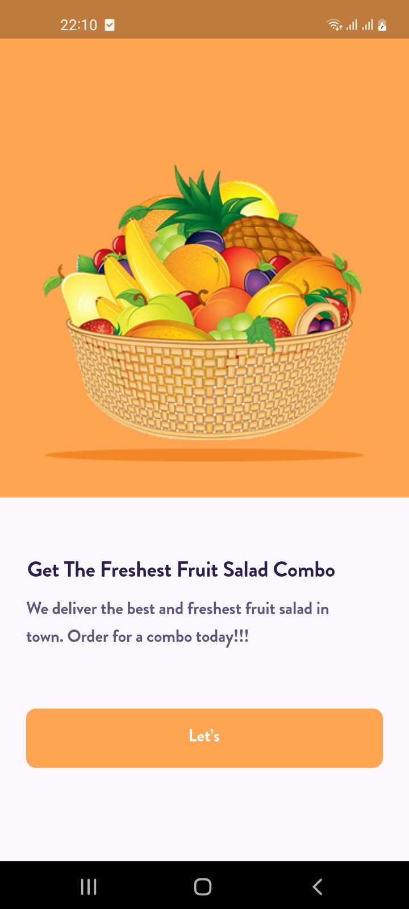
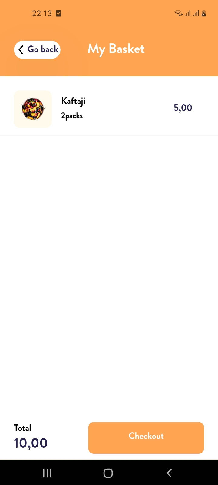

# Mobile UI Kit: Ecommerce (Flutter)

[Figma design](https://www.figma.com/community/file/875021148028188871).

---

## ✨ Preview

> 📲 Below is the original design reference that inspired this Flutter implementation:


---

## 📸 Screenshots

| Screen 1 | Screen 2 | Screen 3 | Screen 4 | Screen 5 | Screen 6 | Screen 7 |
|:-------:|:-------:|:-------:|:-------:|:-------:|:-------:|:-------:|
|  |  |  |  |  |  |  |


---

## 📦 Installation

```bash
# 1. Clone the repository
git clone https://github.com/bougdar/Mobile-UI-Kit--Ecommerce--Community.git
cd Mobile-UI-Kit--Ecommerce--Community

# 2. Install dependencies
flutter pub get

# 3. Run the app
flutter run
